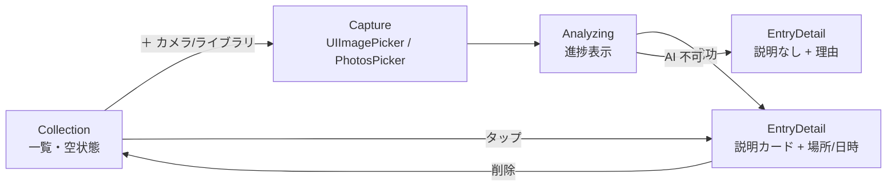
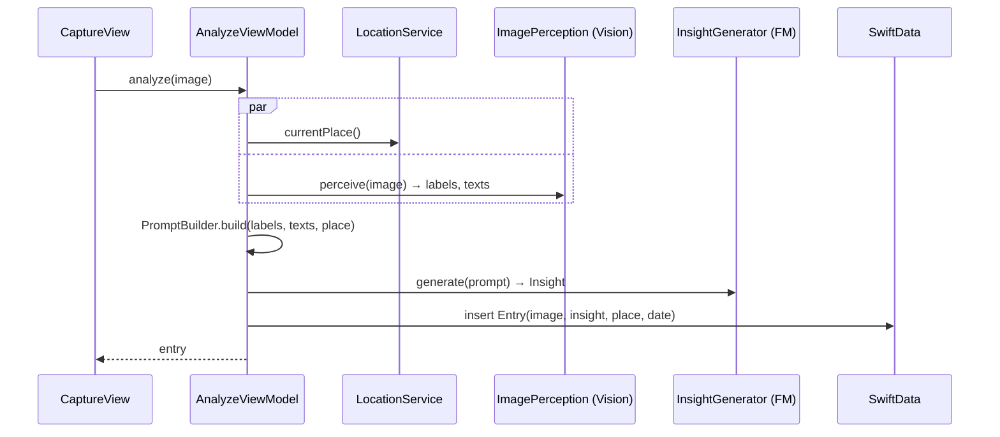

# Meguri MVP 設計

- 読み手: このリポジトリで実装する自分・エージェント
- 目的: MVP の範囲・構成・データの流れを固定し、実装計画（plans/）の根拠にする
- 状態: 2026-09-22 起票。ユーザー就寝中に自律作成したため、朝のレビューで修正前提

## 何を作るか

美術館の絵画や旅先の風景を撮ると、その場で「それが何か・どんな背景があるか」を AI が説明し、
撮った記録がコレクションとして溜まっていく iOS アプリ。

成功条件（MVP）:

1. 写真（カメラ or ライブラリ）→ 数秒で説明カードが出る
2. 説明は Apple 純正 AI のみで生成する（外部 API・課金なし・オフライン可）
3. 撮った場所と日時つきでコレクションに残り、一覧・詳細で見返せる

MVP に含めないもの: アカウント・同期・共有・地域おすすめ・検索・タグ・iPad 最適化。

## 前提と制約

| 項目 | 値 |
|---|---|
| 最低 OS | iOS 26.0 |
| 言語 | Swift 6（strict concurrency）、SwiftUI、Observation |
| 永続化 | SwiftData |
| AI | Foundation Models framework（`LanguageModelSession` + `@Generable`）。画像入力は非対応なので知覚は Vision が担う |
| 知覚 | Vision: `ClassifyImageRequest`（ラベル）、`RecognizeTextRequest`（作品キャプション・案内板の文字） |
| 位置 | CoreLocation（使用中のみ）+ `CLGeocoder` で地名化 |
| Bundle ID / Team | `com.akidon0000.meguri` / `XSC9AJPSP3` |
| ローカライズ | String Catalog、開発言語 en、ja 翻訳を同梱 |
| 依存 | SPM のみ（R.swift・SwiftLintPlugins はテンプレ同梱） |

Foundation Models は端末・設定によって使えない（`SystemLanguageModel.default.availability`）。
使えないときは理由を表示し、コレクション保存だけはできるようにする。

## 画面



- Collection: 新しい順のグリッド。0 件は「最初の一枚を撮ろう」の空状態。
- Capture: `PhotosPicker`（ライブラリ）と `UIImagePickerController` ラッパー（カメラ）の 2 入口。
- Analyzing: 「見ています → 調べています」の 2 段階を表示。キャンセル可。
- EntryDetail: 画像、タイトル、作者/年代、要約、豆知識（最大 3）、カテゴリ、場所、日時。削除メニュー。

## データの流れ



`PromptBuilder` は純粋関数で、ここに「何を AI に渡すか」を集約する。
テキスト認識結果（キャプション）があるときは最優先で使い、ラベルは補助にする。

## 型

```swift
@Generable
struct Insight: Codable, Sendable {
    @Guide(description: "作品名または場所の名前。わからなければ見たままの短い題")
    var title: String
    @Guide(description: "作者・建築家・由来。不明なら空文字")
    var creator: String
    @Guide(description: "制作年・時代・成立年代。不明なら空文字")
    var era: String
    @Guide(description: "2〜3 文の説明。断定できないことは『〜と思われます』と書く")
    var summary: String
    @Guide(description: "豆知識。最大 3 件", .maximumCount(3))
    var funFacts: [String]
    @Guide(description: "artwork / landscape / architecture / other のいずれか")
    var category: Category
    enum Category: String, Codable, CaseIterable, Sendable { case artwork, landscape, architecture, other }
}

@Model
final class Entry {
    var id: UUID
    var createdAt: Date
    var imageFileName: String        // Application Support/Images/<uuid>.jpg
    var thumbnailData: Data           // 一覧用 256px JPEG
    var placeName: String?
    var latitude: Double?
    var longitude: Double?
    var insightData: Data?            // Insight を JSON で保存。nil = AI 不可だった
    var perceivedLabels: [String]
    var recognizedTexts: [String]
}
```

画像本体はファイルに置き、SwiftData には縮小サムネイルだけ持たせる（DB 肥大化とメモリを避ける）。

## サービス境界（テストのための差し替え点）

| protocol | 本番実装 | テストのフェイク |
|---|---|---|
| `ImagePerceiving` | `VisionImagePerception` | ラベル・テキストを固定で返す |
| `InsightGenerating` | `FoundationModelsInsightGenerator` | 固定 `Insight` / 失敗 / 利用不可を返す |
| `LocationProviding` | `CoreLocationService` | 固定の場所を返す / nil |
| `ImageStoring` | `FileImageStore` | 一時ディレクトリ実装（本物を temp で使う） |

`AnalyzeViewModel` は 4 つを注入で受ける。ここが MVP で唯一の「流れ」を持つ場所なので、テストはここに厚く書く。

## エラー方針

| 状況 | 振る舞い |
|---|---|
| AI 利用不可（端末非対応・Apple Intelligence 未有効・モデル準備中） | 説明なしで保存し、詳細画面に理由を表示 |
| 生成失敗（ガードレール・タイムアウト） | 同上。「もう一度」ボタンで再生成できる |
| 位置情報拒否 | 場所なしで進む。設定への導線は出さない（MVP） |
| Vision が何も返さない | 空リストで FM に渡す（「写真から読み取れる情報が少ない」旨をプロンプトに含める） |

## テスト

- Swift Testing。ターゲット `MeguriTests`
- 対象: `PromptBuilder`（入力の組み合わせ → プロンプト文字列）、`Insight` の JSON 往復、`AnalyzeViewModel`（成功 / AI 不可 / 生成失敗 / 位置なし）、`FileImageStore`
- Vision・Foundation Models・CoreLocation の本物は単体テストしない（シミュレータ依存）。実機確認を朝のレビュー項目にする

## 未決事項（朝に確認）

- Foundation Models の絵画同定精度。キャプションが写っていない絵画は同定できない想定
- カメラ撮影時にキャプションも一緒に写すようガイドを出すか
- 英語 UI 文言の自然さ（ja が主、en は機械的でよいか）
