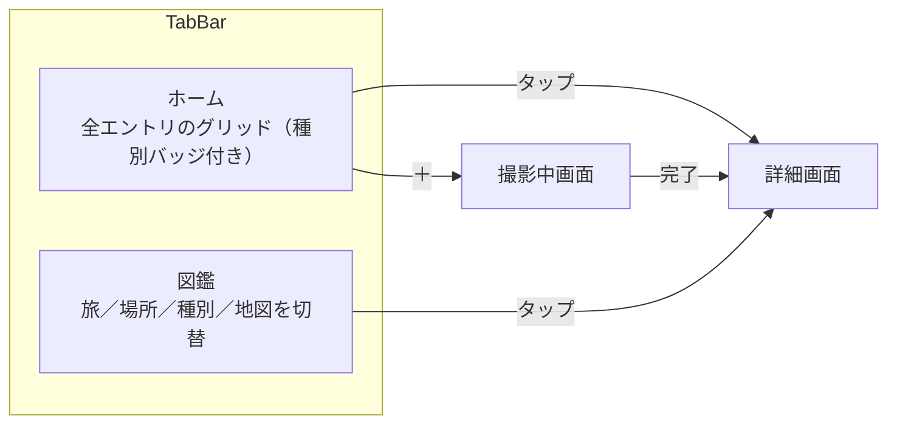

# UI/UX 再設計

- 読み手: このリポジトリで実装する自分・エージェント
- 目的: 現状のUI/UXへの不満を解消する再設計の方針を固定し、実装計画（plans/）の根拠にする
- 状態: 2026-09-22、壁打ちでコンセプトから再検討しユーザー承認済み。次は writing-plans で実装計画を起票する

## 背景

原体験は、ルーブル美術館で写真を撮ってClaudeに都度説明させるのが手間だったこと。そこから
「旅先や街中で気になるものを見かけたとき、いちいち調べずに撮るだけで解説を得て、集めていきたい」
というJTBDに広がった。対象は美術品に限らず、街並みや建築、自然なども含む。

コンセプトは「集める図鑑」— 美術品も街並みも、撮ったものが全部自分だけの図鑑に収まっていく。
現状の3画面（一覧・詳細・撮影中）は標準SwiftUIコンポーネントをほぼそのまま使った素朴な作りで、
独自の配色やブランディングがなく、このコンセプトを体現できていない。

[roadmap.md](../../roadmap.md) にあった「旅タブ／場所タブ」「地図可視化」を構造に組み込む。加えて
壁打ちの中で、図鑑コンセプトを体現するための新しい分類軸として「種別」を追加した。roadmapの残り2候補
（外部LLM API設定、写真保存先選択）は今回のスコープに含めない。

## 画面構成

タブは「ホーム」「図鑑」の2つ（旧案の「振り返る」から改名。コンセプトをタブ名自体に反映する）。
ホームは現行の `CollectionView`（全件・新しい順グリッド）をそのまま残し、各カードに種別バッジを
追加した上で配色を更新する。図鑑タブは新規ビューで、上部のセグメントコントロールで
旅／場所／種別／地図の4状態を切り替える。

TabView導入は今回が初めてなので、ホーム・図鑑各タブが独立した `NavigationStack` を持つ形にする
（図鑑タブから詳細を開いてホームタブに戻っても、それぞれのナビゲーション状態は保たれる）。

## 種別（Category）の分類

図鑑コンセプトの中心となる分類軸。手動タグ付けは「手間なく集める」というJTBDに反するため、
AIが解析時に自動で1つ割り当てる。

- 固定タクソノミー7種: 絵画・彫刻・建築・自然・生き物・街並み・その他
- 分類はAI解析（`AnalyzeViewModel` 相当の処理）の出力として `Insight` に持たせる新規フィールド。
  既存 `Entry` スキーマは変更しないが、`Insight` には項目を1つ追加する（軽微なマイグレーションが発生）
- Homeのカード・詳細画面・図鑑タブの各所で同じバッジ表現を使う
- 自由記述タグにしなかった理由: `場所` グルーピングで既に許容した表記ゆれ問題（同じ対象が別名で
  分裂する）が種別でも起きると、図鑑の分類軸として不安定になるため

## 旅（Trip）のグルーピング

roadmapで未決だった「旅の定義」は自動クラスタリングに決定。`Entry` に「旅」を表す永続モデルは
追加しない — `createdAt` の日付間隔から都度計算する非永続の値として扱う（手動作成UIやスキーマ変更を
避けられるため）。

- `createdAt` の間隔がしきい値を超えたら新しいグループに区切る（具体的な日数は実装計画で決める）
- グループの件数が1件だけなら「旅」として名前を付けず、日付ラベルのみで表示する（単発撮影を旅に押し込まない）
- 2件以上のグループを「旅」として扱い、名前は日付範囲とグループ内の代表地名から自動生成する

## 場所のグルーピング

`Entry.placeName`（自由文字列）をそのままグループキーに使う。表記ゆれで同じ場所が別グループに
分かれる既知の制約は残るが、正規化・逆ジオコーディングでの統一は今回のスコープ外（過剰実装を避ける）。

## 地図

緯度経度を持つ `Entry` のみ MapKit 上にピン表示する。都道府県・国単位の塗り分けは行わない
（ピン表示のみで実装規模を抑える）。位置情報がないエントリは地図に出さない。

## ビジュアルスタイル

ビジュアルコンパニオンで3方向（紙とインク／水彩ポストカード／レザー手帳）を比較し、水彩ポストカードを
ベースに、グラデーションを外したフラット版で確定した。コンセプトが「集める図鑑」に変わった後も、
このトークンセットはそのまま踏襲する（種別バッジの表現を新たに追加する）。

| トークン | 値 | 用途 |
|---|---|---|
| 背景 | `#FAF8F3` | 全画面のベース |
| サーフェス | `#FFFFFF`、枠線 `#EDE8DC` | カード・タブバー・セグメントコントロール |
| 本文インク | `#33302A` | タイトル・本文 |
| 副次テキスト | `#8A9A8E` | 場所名・キャプション・日付 |
| アクセント（セージグリーン） | `#6B8F71` | 選択状態・タブのアクティブ表示 |
| アクセント（テラコッタ） | `#C98A5E` | ハイライト・地図のピン |
| 写真の縁 | 白4px + 枠線1px `#EDE8DC` | サムネイルに「プリントを貼った」質感を出す |
| 種別バッジ | サーフェス地に本文インク文字、枠線 `#EDE8DC` | カード左上に配置。図鑑の「識別ラベル」の役割 |
| フォント | システム標準（`-apple-system` / `Hiragino Sans`） | 独自書体は使わない |

グラデーション・光彩・ぼかしなどの装飾は使わない。初期案（水彩ポストカードのグラデーション版）が
「AIが作ったような見た目」と指摘されたため、フラットな色面と余白で質感を出す方針にした。

## 画面ごとの変更

| 画面 | 変更内容 |
|---|---|
| ホーム（`CollectionView`） | グリッド構成・表示データ（全件）は変えず、上記トークンで再配色。各カードに種別バッジを追加。`navigationTitle` は "Megumemo" のまま |
| 図鑑（新規） | 新規ビュー。上部にセグメントコントロール（旅／場所／種別／地図）。旅・場所・種別はセクション見出し＋ミニグリッドのリスト、地図はMapKitのピン表示 |
| 詳細（`EntryDetailView`） | レイアウト構成は変えず、カード・配色を新トークンに合わせる。種別バッジを表示に追加 |
| 撮影中（`AnalyzingView`） | 背景・配色を新トークンに合わせる。進捗表示→詳細画面への遷移という構成は変えない |

`EntryCard`（一覧のカード）は写真の縁の質感と種別バッジを新規に持つ最小単位なので、新しい共有
コンポーネントとして切り出し、ホーム・図鑑の両方から使う。

## データ・型への影響

新しい `SwiftData` モデルは追加しない。「旅」は引き続きグルーピング関数が返す非永続の構造体として
扱う。一方で `Insight` には種別（固定タクソノミー7種のenum）フィールドを新規追加する — 既存データへの
マイグレーション方針（既存エントリの種別をどう埋めるか）は実装計画で詰める。

## テスト

クラスタリング関数（日付間隔からグループを作る処理）を `AnalyzeViewModel` などと同様に純粋関数として
切り出し、境界（しきい値ちょうど、1件のみ、複数地点混在）を単体テストでカバーする。種別はAIによる
分類のためユニットテストの対象外とし、バッジ表示・フィルタリングのUIテストで確認する。配色・レイアウトは
SwiftUI PreviewとシミュレータのUIテストで確認する。

## スコープ外

- 外部LLM API設定画面、写真保存先選択設定画面（[roadmap.md](../../roadmap.md) に残したまま）
- 場所名の表記ゆれ正規化
- 都道府県・国単位の地図塗り分け
- 旅の手動作成・並び替えUI
- 種別の手動編集・複数種別の同時付与

## 未決事項（実装計画で詰める）

- クラスタリングのしきい値（日数）の具体値
- 旅の名前の自動生成ロジック（代表地名の決め方、複数地名が混在するときの表記）
- 旅の名前を後から編集できるようにするか（壁打ち中に選択肢としては出たが、明示的な合意はまだない）
- 既存エントリへの種別マイグレーション方針（再解析するか、「その他」で一律埋めるか）
- AIが種別を確信を持って判定できない場合のフォールバック
- 「図鑑」タブの英語ローカライズ文言

## 参考

- [roadmap.md](../../roadmap.md) — 「旅タブ／場所タブ」「地図可視化」の元の論点
- [market-research.md](../../market-research.md) — 当初想定していた対象ペルソナ（美術館・旅先で足を
  止めるが説明を読まずに通り過ぎる人）。今回のコンセプトは開発者本人のルーブル美術館での原体験から
  再定義した
- ビジュアルコンパニオンでの検討過程は `.superpowers/brainstorm/`（gitignore対象、ローカルのみ）に残る
