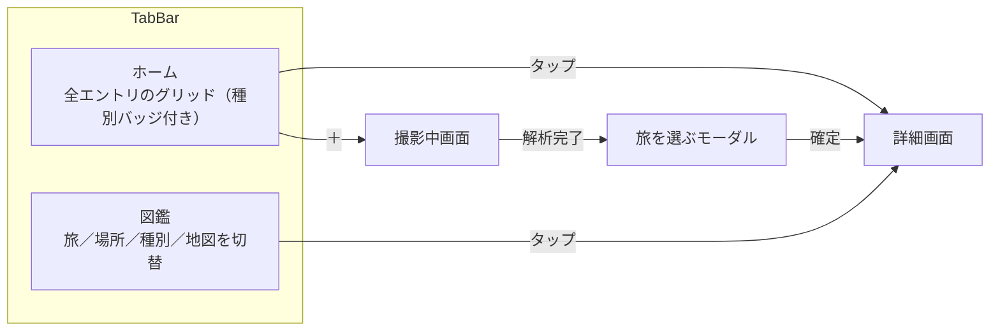

# UI/UX 再設計

- 読み手: このリポジトリで実装する自分・エージェント
- 目的: 現状のUI/UXへの不満を解消する再設計の方針を固定し、実装計画（plans/）の根拠にする
- 状態: 2026-09-22、コンセプトの壁打ちに加え、旅の管理方式を pv-grill-me での深掘りで見直した。
  ユーザー承認済み。次は writing-plans で実装計画を更新する

## 背景

原体験は、ルーブル美術館で写真を撮ってClaudeに都度説明させるのが手間だったこと。そこから
「旅先や街中で気になるものを見かけたとき、いちいち調べずに撮るだけで解説を得て、集めていきたい」
というJTBDに広がった。対象は美術品に限らず、街並みや建築、自然なども含む。

コンセプトは「集める図鑑」— 美術品も街並みも、撮ったものが全部自分だけの図鑑に収まっていく。
現状の3画面（一覧・詳細・撮影中）は標準SwiftUIコンポーネントをほぼそのまま使った素朴な作りで、
独自の配色やブランディングがなく、このコンセプトを体現できていない。

[roadmap.md](../../roadmap.md) にあった「旅タブ／場所タブ」「地図可視化」を構造に組み込む。加えて
壁打ちの中で、図鑑コンセプトを体現するための新しい分類軸として「種別」を追加した。roadmapの残り2候補
（外部LLM API設定、写真保存先選択）は今回のスコープに含めない。

## 画面構成

タブは「ホーム」「図鑑」の2つ（旧案の「振り返る」から改名。コンセプトをタブ名自体に反映する）。
ホームは現行の `CollectionView`（全件・新しい順グリッド）をそのまま残し、各カードに種別バッジを
追加した上で配色を更新する。図鑑タブは新規ビューで、上部のセグメントコントロールで
旅／場所／種別／地図の4状態を切り替える。

撮影中画面で解析が終わった直後、詳細画面に入る前に「旅を選ぶモーダル」を挟む（詳細はSection
「旅（Trip）のグルーピング」参照）。カメラ撮影・ライブラリから選ぶ、どちらの経路でも同じ扱い。

TabView導入は今回が初めてなので、ホーム・図鑑各タブが独立した `NavigationStack` を持つ形にする
（図鑑タブから詳細を開いてホームタブに戻っても、それぞれのナビゲーション状態は保たれる）。

## 種別（Category）の分類

図鑑コンセプトの中心となる分類軸。手動タグ付けは「手間なく集める」というJTBDに反するため、
AIが解析時に自動で1つ割り当てる。

- 固定タクソノミー7種: 絵画・彫刻・建築・自然・生き物・街並み・その他
- 分類はAI解析（`AnalyzeViewModel` 相当の処理）の出力として `Insight` に持たせる新規フィールド。
  既存 `Entry` スキーマは変更しないが、`Insight` には項目を1つ追加する（軽微なマイグレーションが発生）
- Homeのカード・詳細画面・図鑑タブの各所で同じバッジ表現を使う
- 自由記述タグにしなかった理由: `場所` グルーピングで既に許容した表記ゆれ問題（同じ対象が別名で
  分裂する）が種別でも起きると、図鑑の分類軸として不安定になるため

## 旅（Trip）のグルーピング

roadmapで未決だった「旅の定義」は、自動クラスタリングのみでは不十分と判断し、**撮影直後にユーザーが
決める永続モデル**に変更した（pv-grill-meでの深掘りで、自動クラスタリング一本足の設計を見直した）。

### 撮影直後のモーダル

`AnalyzingView` の解析完了後・詳細画面へ遷移する前に、モーダルで「どの旅に追加するか」を確認する。

- デフォルト選択: 直前に使った旅の最新エントリが2日以内なら、その旅を提案する。2日を超えていれば
  「新しい旅を作る」（名前は撮影日・地名から自動提案、自由編集可能）をデフォルトにする。基本はこの
  提案のままワンタップで確定できる
- 他の選択肢: 既存の旅一覧から選び直す／「旅に追加しない」（単発で撮りたい場合の要件を満たす）
- 旅の名前・エントリの所属旅は、後から図鑑タブの旅ビューで変更できる（撮影時の割り当てを最終としない）

### データモデル

新規に `Trip`（`id`, `name`）を`SwiftData`モデルとして追加し、`Entry` に `trip: Trip?` を追加する
（Entryスキーマ変更を伴う）。Trip側に`entries`の逆参照は持たず、表示側で`entry.trip?.id`によるフィルタ
で十分とする。

### 未割り当てエントリの扱い

`trip == nil` のエントリ（この機能の導入前に撮った既存エントリ、または「旅に追加しない」を選んだ
エントリ）は、従来通り `createdAt` の日付間隔クラスタリングで「未割り当て」セクションにまとめて
図鑑の旅ビューに表示する。しきい値はモーダルのデフォルト選択と同じ2日を使う。

- `createdAt` の間隔が2日を超えたら新しいクラスタに区切る
- クラスタの件数が1件だけなら日付ラベルのみで表示する（単発撮影を旅に押し込まない）
- 2件以上のクラスタは、日付範囲とクラスタ内の代表地名から表示名を自動生成する

## 場所のグルーピング

`Entry.placeName`（自由文字列）をそのままグループキーに使う。表記ゆれで同じ場所が別グループに
分かれる既知の制約は残るが、正規化・逆ジオコーディングでの統一は今回のスコープ外（過剰実装を避ける）。

## 地図

緯度経度を持つ `Entry` のみ MapKit 上にピン表示する。都道府県・国単位の塗り分けは行わない
（ピン表示のみで実装規模を抑える）。位置情報がないエントリは地図に出さない。位置情報付きエントリが
1件も無い場合は、空の地図をそのまま出さず専用の空状態メッセージを表示する。

## ビジュアルスタイル

ビジュアルコンパニオンで3方向（紙とインク／水彩ポストカード／レザー手帳）を比較し、水彩ポストカードを
ベースに、グラデーションを外したフラット版で確定した。コンセプトが「集める図鑑」に変わった後も、
このトークンセットはそのまま踏襲する（種別バッジの表現を新たに追加する）。

| トークン | 値 | 用途 |
|---|---|---|
| 背景 | `#FAF8F3` | 全画面のベース |
| サーフェス | `#FFFFFF`、枠線 `#EDE8DC` | カード・タブバー・セグメントコントロール |
| 本文インク | `#33302A` | タイトル・本文 |
| 副次テキスト | `#8A9A8E` | 場所名・キャプション・日付 |
| アクセント（セージグリーン） | `#6B8F71` | 選択状態・タブのアクティブ表示 |
| アクセント（テラコッタ） | `#C98A5E` | ハイライト・地図のピン |
| 写真の縁 | 白4px + 枠線1px `#EDE8DC` | サムネイルに「プリントを貼った」質感を出す |
| 種別バッジ | サーフェス地に本文インク文字、枠線 `#EDE8DC` | カード右下（写真の上に重ねる）に配置。図鑑の「識別ラベル」の役割 |
| フォント | システム標準（`-apple-system` / `Hiragino Sans`） | 独自書体は使わない |

グラデーション・光彩・ぼかしなどの装飾は使わない。初期案（水彩ポストカードのグラデーション版）が
「AIが作ったような見た目」と指摘されたため、フラットな色面と余白で質感を出す方針にした。

## 画面ごとの変更

| 画面 | 変更内容 |
|---|---|
| ホーム（`CollectionView`） | グリッド構成・表示データ（全件）は変えず、上記トークンで再配色。各カードに種別バッジを追加。`navigationTitle` は "Megumemo" のまま |
| 図鑑（新規） | 新規ビュー。上部にセグメントコントロール（旅／場所／種別／地図）。旅は「Tripモデルの一覧」＋「未割り当てクラスタ」の2段、場所・種別はセクション見出し＋ミニグリッドのリスト、地図はMapKitのピン表示（位置情報付きが0件なら空状態表示） |
| 詳細（`EntryDetailView`） | レイアウト構成は変えず、カード・配色を新トークンに合わせる。種別バッジを表示に追加 |
| 撮影中（`AnalyzingView`） | 背景・配色を新トークンに合わせる。解析完了後、詳細画面に入る前に新規の「旅を選ぶモーダル」を挟む |

`EntryCard`（一覧のカード）は写真の縁の質感と種別バッジを新規に持つ最小単位なので、新しい共有
コンポーネントとして切り出し、ホーム・図鑑の両方から使う。

## データ・型への影響

- `Insight` には種別（固定タクソノミー7種のenum）フィールドを新規追加する。既存データ互換性は
  デコード時のフォールバック（未知の値は「その他」扱い）で確保し、一括マイグレーションは行わない
- 新規に `Trip`（`id`, `name`）を`SwiftData`モデルとして追加する
- `Entry` に `trip: Trip?` を追加する（Entryスキーマ変更）
- `trip == nil` のエントリは「未割り当て」として、従来通り非永続のクラスタリング関数で表示する

## テスト

未割り当てエントリのクラスタリング関数、およびモーダルの「デフォルト選択（直前の旅 or 新規提案）」
ロジックは `AnalyzeViewModel` などと同様に純粋関数として切り出し、境界（しきい値ちょうど、1件のみ、
複数地点混在、直前の旅が無い場合）を単体テストでカバーする。種別はAIによる分類のためユニットテストの
対象外とし、バッジ表示・フィルタリングのUIテストで確認する。配色・レイアウトはSwiftUI Previewと
シミュレータのUIテストで確認する。

## スコープ外

- 外部LLM API設定画面、写真保存先選択設定画面（[roadmap.md](../../roadmap.md) に残したまま）
- 場所名の表記ゆれ正規化
- 都道府県・国単位の地図塗り分け
- 旅の並び替えUI（作成順のまま表示する）
- 種別の手動編集・複数種別の同時付与
- 汎用の設定画面の新設（旅のしきい値などの調整項目は今回設けない。2日固定）

## 未決事項（実装計画で詰める）

- AIが種別を確信を持って判定できない場合のフォールバック
- モーダルの具体的なレイアウト（既存の旅一覧の見せ方など）

## 参考

- [roadmap.md](../../roadmap.md) — 「旅タブ／場所タブ」「地図可視化」の元の論点
- [market-research.md](../../market-research.md) — 当初想定していた対象ペルソナ（美術館・旅先で足を
  止めるが説明を読まずに通り過ぎる人）。今回のコンセプトは開発者本人のルーブル美術館での原体験から
  再定義した
- ビジュアルコンパニオンでの検討過程は `.superpowers/brainstorm/`（gitignore対象、ローカルのみ）に残る
