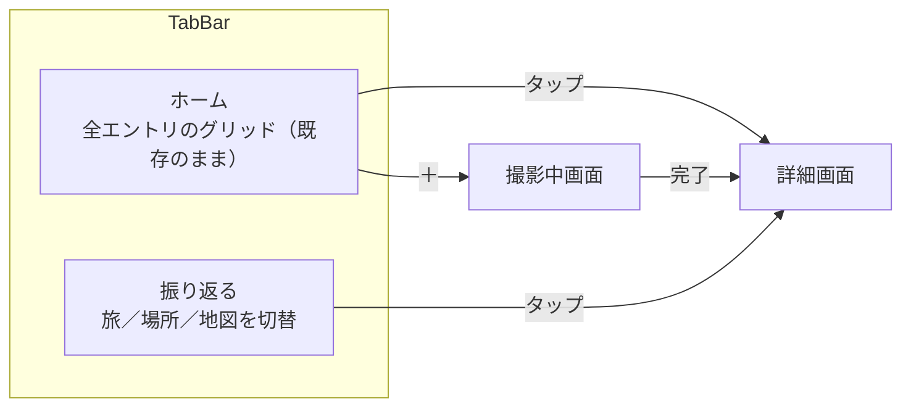

# UI/UX 再設計

- 読み手: このリポジトリで実装する自分・エージェント
- 目的: 現状のUI/UXへの不満を解消する再設計の方針を固定し、実装計画（plans/）の根拠にする
- 状態: 2026-09-22、ビジュアルコンパニオンでの壁打ちを経てユーザー承認済み。次は writing-plans で実装計画を起票する

## 背景

現状の3画面（一覧・詳細・撮影中）は標準SwiftUIコンポーネントをほぼそのまま使った素朴な作りで、
独自の配色やブランディングがない。加えて、[roadmap.md](../../roadmap.md) にあった「旅タブ／場所タブ」
「地図可視化」は構造上の変更を伴うため、見た目の作り直しと同時に画面構成そのものを見直す。

対象は既存の3画面（一覧・詳細・撮影中）すべてと、新設する「振り返る」画面。
roadmapの残り2候補（外部LLM API設定、写真保存先選択）は今回のスコープに含めない。

## 画面構成

タブは「ホーム」「振り返る」の2つ。ホームは現行の `CollectionView`（全件・新しい順グリッド）を
そのまま残し、配色だけ更新する。新規に「振り返る」画面を追加し、その中をセグメントコントロールで
旅／場所／地図に切り替える。

TabView導入は今回が初めてなので、ホーム・振り返る各タブが独立した `NavigationStack` を持つ形にする
（振り返るタブから詳細を開いてホームタブに戻っても、それぞれのナビゲーション状態は保たれる）。

## 旅（Trip）のグルーピング

roadmapで未決だった「旅の定義」は自動クラスタリングに決定。`Entry` に「旅」を表す永続モデルは
追加しない — `createdAt` の日付間隔から都度計算する非永続の値として扱う（手動作成UIやスキーマ変更を
避けられるため）。

- `createdAt` の間隔がしきい値を超えたら新しいグループに区切る（具体的な日数は実装計画で決める）
- グループの件数が1件だけなら「旅」として名前を付けず、日付ラベルのみで表示する（単発撮影を旅に押し込まない）
- 2件以上のグループを「旅」として扱い、名前は日付範囲とグループ内の代表地名から自動生成する

## 場所のグルーピング

`Entry.placeName`（自由文字列）をそのままグループキーに使う。表記ゆれで同じ場所が別グループに
分かれる既知の制約は残るが、正規化・逆ジオコーディングでの統一は今回のスコープ外（過剰実装を避ける）。

## 地図

緯度経度を持つ `Entry` のみ MapKit 上にピン表示する。都道府県・国単位の塗り分けは行わない
（ピン表示のみで実装規模を抑える）。位置情報がないエントリは地図に出さない。

## ビジュアルスタイル

ビジュアルコンパニオンで3方向（紙とインク／水彩ポストカード／レザー手帳）を比較し、水彩ポストカードを
ベースに、グラデーションを外したフラット版で確定した。

| トークン | 値 | 用途 |
|---|---|---|
| 背景 | `#FAF8F3` | 全画面のベース |
| サーフェス | `#FFFFFF`、枠線 `#EDE8DC` | カード・タブバー・セグメントコントロール |
| 本文インク | `#33302A` | タイトル・本文 |
| 副次テキスト | `#8A9A8E` | 場所名・キャプション・日付 |
| アクセント（セージグリーン） | `#6B8F71` | 選択状態・タブのアクティブ表示 |
| アクセント（テラコッタ） | `#C98A5E` | ハイライト・地図のピン |
| 写真の縁 | 白4px + 枠線1px `#EDE8DC` | サムネイルに「プリントを貼った」質感を出す |
| フォント | システム標準（`-apple-system` / `Hiragino Sans`） | 独自書体は使わない |

グラデーション・光彩・ぼかしなどの装飾は使わない。初期案（水彩ポストカードのグラデーション版）が
「AIが作ったような見た目」と指摘されたため、フラットな色面と余白で質感を出す方針にした。

## 画面ごとの変更

| 画面 | 変更内容 |
|---|---|
| ホーム（`CollectionView`） | グリッド構成・表示データ（全件）は変えず、上記トークンで再配色。`navigationTitle` は "Megumemo" のまま |
| 振り返る（新規） | 新規ビュー。上部にセグメントコントロール（旅／場所／地図）。旅・場所はセクション見出し＋ミニグリッドのリスト、地図はMapKitのピン表示 |
| 詳細（`EntryDetailView`） | レイアウト構成は変えず、カード・配色を新トークンに合わせる |
| 撮影中（`AnalyzingView`） | 背景・配色を新トークンに合わせる。進捗表示→詳細画面への遷移という構成は変えない |

`EntryCard`（一覧のカード）は写真の縁の質感を新規に持つ最小単位なので、新しい共有コンポーネントとして
切り出し、ホーム・振り返るの両方から使う。

## データ・型への影響

新しい `SwiftData` モデルは追加しない。「旅」はグルーピング関数が返す非永続の構造体として扱い、
`Entry` の既存スキーマは変更なし。

## テスト

クラスタリング関数（日付間隔からグループを作る処理）を `AnalyzeViewModel` などと同様に純粋関数として
切り出し、境界（しきい値ちょうど、1件のみ、複数地点混在）を単体テストでカバーする。配色・レイアウトは
SwiftUI PreviewとシミュレータのUIテストで確認する。

## スコープ外

- 外部LLM API設定画面、写真保存先選択設定画面（[roadmap.md](../../roadmap.md) に残したまま）
- 場所名の表記ゆれ正規化
- 都道府県・国単位の地図塗り分け
- 旅の手動作成・並び替えUI

## 未決事項（実装計画で詰める）

- クラスタリングのしきい値（日数）の具体値
- 旅の名前の自動生成ロジック（代表地名の決め方、複数地名が混在するときの表記）
- 旅の名前を後から編集できるようにするか（壁打ち中に選択肢としては出たが、明示的な合意はまだない）
- 「振り返る」タブの英語ローカライズ文言

## 参考

- [roadmap.md](../../roadmap.md) — 「旅タブ／場所タブ」「地図可視化」の元の論点
- [market-research.md](../../market-research.md) — 対象ペルソナ（美術館・旅先で足を止めるが説明を読まずに通り過ぎる人）
- ビジュアルコンパニオンでの検討過程は `.superpowers/brainstorm/`（gitignore対象、ローカルのみ）に残る
